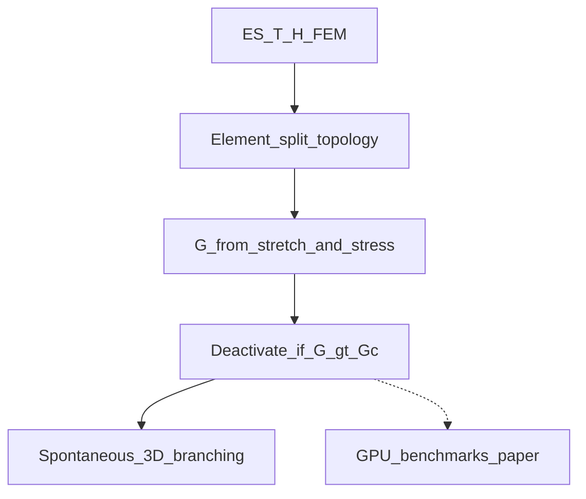

# 3D Crack Element Method (arXiv:2508.04076)

Xie, Wu, Hu, Xu, Bui & Li, *A GPU-Accelerated Three-Dimensional Crack Element Method for Transient Dynamic Fracture Simulation*, [arXiv:2508.04076](https://arxiv.org/abs/2508.04076).

This module is a **research scaffold**: ES-FEM CEM pipeline stages, tet/hex crack patterns, benchmark constants, and a **CPU port of G_I / G_II** (paper Eqs. 17–18) for unit validation. It does **not** ship ES-FEM assembly, GPU Newmark, or replace engine DMM.

## Graphical abstract



**Paper highlights (scaffold honesty in parentheses):**

- Novel 3D CEM with element-splitting + fracture energy release rate from split topology *(CPU G_I/G_II only here)*.
- Element-wise crack growth including branching; fractured displacement via ES-FEM *(no ES-FEM runtime)*.
- G evaluated from evolving split-element topology *(formula lock-in for `phys_cem`)*.
- All paper 3D benchmarks use NVIDIA GPU acceleration *(engine has no CEM kernels yet)*.

## Toggle

| Cvar | Default | Purpose |
|------|---------|---------|
| `cl_cem_enable` | `0` | Gate console commands |

## Build

```bash
./scripts/compile_engine.sh vulkan full
ctest -R unit_cem -V
./tests/scripts/test_cem.sh build-vk-Release
```

Requires **`USE_RESEARCH_EXTENSIONS=ON`**.

## Honesty vs DMM / RTFEM / VGS

| Paper CEM | Engine today |
|-----------|----------------|
| ES-FEM + topology G ≥ Gc deactivate | `phys_dmm` stress-grid → rigid debris boxes |
| SCA09-style tet FEM | [RTFEM.md](RTFEM.md) scaffold only |
| Soft / voxel PBD | [VGS.md](VGS.md) / softblob — different problem |

Shipping destructibles: [PHYSICS.md](PHYSICS.md) Soft Step DMM companion.

## G formulas (summary)

For unit normal \(\mathbf{n}\), edge stretches \(\boldsymbol{\delta}\), max principal stresses \(\boldsymbol{\sigma}_G\):

\[
\mathcal{G}_I = \tfrac12\bigl[(\boldsymbol{\sigma}_{G3}\cdot\mathbf{n})(\boldsymbol{\delta}_1\cdot\mathbf{n}) + (\boldsymbol{\sigma}_{G4}\cdot\mathbf{n})(\boldsymbol{\delta}_2\cdot\mathbf{n})\bigr]
\]

\[
\mathcal{G}_{II} = \tfrac12\bigl[(\boldsymbol{\sigma}_{G6}\cdot\mathbf{n})(\boldsymbol{\delta}_1\cdot\mathbf{n}) + (\boldsymbol{\sigma}_{G6}\cdot\mathbf{n})(\boldsymbol{\delta}_2\cdot\mathbf{n})\bigr]
\]

Fail when \(\mathcal{G} \ge \mathcal{G}_c\) (`Cem_ShouldFail`). Hex patterns III–VI reuse these forms.

## Console

```
set cl_cem_enable 1
cem_paper
cem_pipeline
cem_patterns
cem_gaps
cem_advice branch
cem_status
```

Advice keys: `branch` | `mesh` | `limit` | `gpu`.

## Demo

```
exec demo_cem.cfg
```

## Follow-up

`modules/physics/phys_cem.c` POST-step ES-FEM / element split + optional GPU Newmark — separate epic.

## Related

- Destructibles: [PHYSICS.md](PHYSICS.md)
- Tet FEM scaffold: [RTFEM.md](RTFEM.md)
- Voxel soft PBD: [VGS.md](VGS.md)

## References

- Xie et al., arXiv:2508.04076
