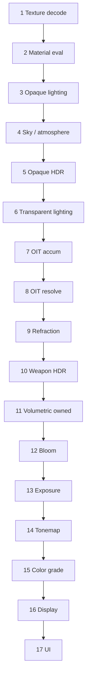

# Color Pipeline Contract

**Status:** Phase 1–2.5 complete + **Phase 2.7** live WBOIT/MBOIT GPU image-diff certification (deferred GPU snapshots, fixture references, `oit_certify_core` → soak → production promotion).  
**Code:** `vk_color_contract.c` / `vk_oit_contract.c` / `vk_oit_alpha.c` / `vk_depth_contract.c` / `vk_hdr_resolve_contract.c` / `vk_oit_weight_contract.c` / `vk_wboit_production_cert.c` / `vk_cert_readback.c` / `vk_cert_metrics.c` / `vk_oit_cert_geometry.c` / `vk_oit_lab.c` / `vk_transparency_lab.c` / `vk_specialized_transparency.c`  
**Commands:** `color_pipeline_status`, `oit_contract_status`, `oit_weight_status`, `wboit_production_status`, `oit_certify_core`, `oit_lab_run`, `mboit_image_diff_status`, `cert_readback_capture`, `oit_certification_export`  
**Debug:** `r_oitCertificationDebug`, `r_transparencyReference`, `r_oitAllowManualCertification`, `r_requireWboitCertification`

This document is the single contract for scene-linear color and transparency. Older notes in [HDR_PIPELINE.md](HDR_PIPELINE.md) and [WBOIT_FOG_LAYERS.md](WBOIT_FOG_LAYERS.md) defer to this order for composition. Exact WBOIT math/formats/blends: [WBOIT_CONTRACT.md](WBOIT_CONTRACT.md). Alpha source encoding: [WBOIT_ALPHA_ENCODING.md](WBOIT_ALPHA_ENCODING.md). Live GPU certification: [WBOIT_LIVE_CERTIFICATION.md](WBOIT_LIVE_CERTIFICATION.md). Specialized routes: [TRANSPARENCY_ROUTING.md](TRANSPARENCY_ROUTING.md).

**Do not** start virtual shadows, DDGI, meshlets, ray tracing, or further GPU-driven migration until `WBOIT_PRODUCTION_CERTIFIED` is granted from **measured GPU evidence** (not manual stage flags). Do not begin Color Pipeline Phase 3 until that gate passes.

---

## Production policy

| Path | Cvar | Policy |
|------|------|--------|
| WBOIT | `r_oit 1` | **Production** general-purpose OIT |
| MBOIT | `r_oit 2` | **Experimental** until it passes its own live GPU image-diff matrix; WBOIT certification does not transfer |
| Specialized | refractive / portal / screenMap | After OIT resolve; not in WBOIT accum |
| Off | `r_oit 0` | Sorted alpha (legacy); still must respect spaces below |

All transparent lighting and OIT composition occur in **SCENE_LINEAR_HDR**. No pass may mix gamma-encoded, pre-exposed, tone-mapped, premultiplied, or straight-alpha data without an explicit encode/decode at a named stage boundary.

### Live GPU Image-Diff Certification

WBOIT production promotion requires measured GPU evidence. The live lab records fog/accum/reveal/resolved snapshots after OIT resolve, builds deterministic CPU references for fixture pixels, and records **GPU image-diff** evidence (`WBOIT_EVIDENCE_GPU_IMAGE_DIFF`) with RMSE, max absolute RGB error, mean relative luminance error, and valid pixel count. Center-sample checks are retained only as a sanity signal; they are not sufficient for production promotion.

Required command path:

```text
exec modern_vulkan.cfg
oit_certify_core
wboit_production_status
oit_certification_export
```

MBOIT has a separate live gate:

```text
exec vulkan_overlay_mboit.cfg
oit_lab_run mboit_compare
mboit_image_diff_status
```

`mboit_image_diff_status` reports the last MBOIT single-layer GPU image-diff result. It does not mark WBOIT production stages and should be expanded into a full MBOIT matrix before `r_oit 2` becomes a shipping default.

---

## Color spaces

```text
TEXTURE_SRGB
TEXTURE_LINEAR
SCENE_LINEAR_HDR
PREEXPOSED_SCENE_LINEAR_HDR
DISPLAY_LINEAR
DISPLAY_ENCODED
```

| Space | Meaning | Typical owners |
|-------|---------|----------------|
| `TEXTURE_SRGB` | Encoded albedo / emissive samples before decode | Sampler sRGB views |
| `TEXTURE_LINEAR` | Decoded material inputs (albedo, roughness scalars already linear) | Texture decode / material eval |
| `SCENE_LINEAR_HDR` | Scene radiance before exposure; opaque + transparent + bloom | Lighting, OIT, weapon, volumetrics |
| `PREEXPOSED_SCENE_LINEAR_HDR` | Scene HDR × exposure | Auto-exposure apply |
| `DISPLAY_LINEAR` | Tone-mapped, still linear for grading | Tonemap, color grade |
| `DISPLAY_ENCODED` | Transfer-function encoded for swapchain / UI | Display transform, UI |

### Alpha encodings

| Encoding | Use |
|----------|-----|
| `opaque` | No alpha blend |
| `straight` | RGB unrelated to α (material opacity before premultiply) |
| `premultiplied` | WBOIT accum color × weight (RGB already × α factors) |
| `coverage` | Reveal / ∏(1−α) product for WBOIT resolve |

---

## Required pass order

```text
 1. Texture decode
 2. Material evaluation
 3. Opaque scene-linear lighting
 4. Sky and atmosphere
 5. Opaque HDR composition
 6. Transparent scene-linear lighting
 7. OIT accumulation
 8. OIT resolve over opaque HDR
 9. Specialized refraction
10. Weapon HDR composition
11. Volumetric integration where owned
12. Bloom extraction and convolution
13. Exposure
14. Tone mapping
15. Color grading
16. Display transform
17. UI composition
```



Stage enums in `vkColorPipelineStage_t` match this list 1:1. Runtime writers call `vk_color_contract_note_stage()`.

---

## Stage ↔ expected space / alpha

| # | Stage | Space | Alpha |
|---|-------|-------|-------|
| 1 | texture_decode | `TEXTURE_LINEAR` (from `TEXTURE_SRGB` where applicable) | opaque |
| 2 | material_eval | `SCENE_LINEAR_HDR` inputs | opaque / straight opacity |
| 3 | opaque_lighting | `SCENE_LINEAR_HDR` | opaque |
| 4 | sky_atmosphere | `SCENE_LINEAR_HDR` | opaque |
| 5 | opaque_hdr_composite | `SCENE_LINEAR_HDR` | opaque |
| 6 | transparent_lighting | `SCENE_LINEAR_HDR` | straight |
| 7 | oit_accum | `SCENE_LINEAR_HDR` | premultiplied |
| 8 | oit_resolve | `SCENE_LINEAR_HDR` | coverage |
| 9 | refraction | `SCENE_LINEAR_HDR` | specialized |
| 10 | weapon_hdr | `SCENE_LINEAR_HDR` | opaque |
| 11 | volumetric | `SCENE_LINEAR_HDR` | as owned |
| 12 | bloom | `SCENE_LINEAR_HDR` | opaque |
| 13 | exposure | `PREEXPOSED_SCENE_LINEAR_HDR` | opaque |
| 14 | tonemap | `DISPLAY_LINEAR` | opaque |
| 15 | color_grade | `DISPLAY_LINEAR` | opaque |
| 16 | display_transform | `DISPLAY_ENCODED` | opaque |
| 17 | ui | `DISPLAY_ENCODED` | straight |

---

## Hard rules

1. **Decode once.** Albedo from sRGB textures becomes linear before lighting. Do not light in encoded space.
2. **OIT before exposure/tonemap.** Accum and resolve write `SCENE_LINEAR_HDR` over opaque HDR. Never resolve into LDR or display-encoded targets.
3. **Premultiply only at accum.** Transparent lit radiance uses straight α for coverage; WBOIT weights produce premultiplied accum + coverage reveal.
4. **No double fog on resolve.** Fog ownership: [WBOIT_FOG_LAYERS.md](WBOIT_FOG_LAYERS.md).
5. **Weapon after OIT.** Viewmodel HDR composites after resolve/refraction, still scene-linear.
6. **Bloom before exposure** (or bloom on pre-exposed only if the exposure stage owns both — current spine: bloom on scene HDR, then exposure).
7. **UI last.** UI draws in `DISPLAY_ENCODED`; do not feed UI into bloom/tonemap.

---

## Runtime enforcement

| Hook | Role |
|------|------|
| `vk_color_contract_register()` | Cvars + `color_pipeline_*` commands (from `R_Init`) |
| `vk_color_contract_begin_frame()` | Clear per-frame stage notes (with black-frame begin) |
| `vk_color_contract_note_stage()` | Record writer + check space / order |
| `vk_color_contract_validate()` | Static table + frame mismatches |
| `vk_scene_hdr_ownership_*` | IQ P0-A SceneHDR last-writer ownership (`scene_hdr_status`) |
| Black-frame pass names | Map `ForwardOpaque` / `WBOIT*` / `Bloom` / `Tonemap` / … into stages |

### IQ P0 ownership rules (SceneHDR)

- Raster / neural GI must not **replace** SceneHDR after `WBOIT_RESOLVE` (`vk_scene_hdr_allows_pre_oit_gi`).
- Production spine: opaque → OIT resolve → refraction → **weapon** → bloom (`r_weaponBloomMode 1` defers bloom until after weapon flush even without TAA).
- With `r_oit >= 1`, `r_oitFogMode 0` is refused (effective mode 1); frame-end volumetric must not re-fog resolved WBOIT.
- `r_oit 2` (MBOIT) requires `r_oitAllowExperimentalMboit 1`; otherwise WBOIT fallback.

### IQ P1 (image quality)

See [RENDERER_P1_CERTIFICATION.md](RENDERER_P1_CERTIFICATION.md) and `exec modern_raster_iq_reference.cfg`. Bloom firefly clamp is extract-only (`r_bloomFireflyClamp`).

`oit_status` `passOrder=` mirrors the production spine abbreviated as:

```text
opaque→deferred→oit_accum→oit_resolve→refractive→weapon→bloom→exposure→tonemap→grade→display→ui
```

Full 17-step contract remains authoritative in this doc and `color_pipeline_status`.

---

## Relation to HDR_PIPELINE.md

[HDR_PIPELINE.md](HDR_PIPELINE.md) covers post-chain bookkeeping (`vk_hdr_pipeline_*`: scene / bloom / exposure / tonemap / gamma). Color Pipeline Phase 1 **extends** that with texture→material→OIT→weapon ordering and explicit spaces. Prefer `color_pipeline_status` when diagnosing transparency or space mismatches; use `hdr_pipeline_status` for post-chain writer spine.

---

## Certification (Phase 1 + 2.1–2.5)

Static gates:

- `tests/scripts/test_color_pipeline_contract.sh` — spaces + 17-stage order
- `tests/scripts/test_oit_contract.sh` — frozen WBOIT `oitContract_t`
- `tests/scripts/test_oit_alpha_contract.sh` — Phase 2.2 alpha encoding / normalize / accum
- `tests/scripts/test_depth_contract.sh` / `test_oit_view_depth.sh` — Phase 2.3 depth + view-depth fog
- `tests/scripts/test_hdr_resolve_integrity.sh` — Phase 2.4 resolve / fog_scene generations
- `tests/scripts/test_oit_weight_contract.sh` — Phase 2.5 bounded weight + additive routing

Run via `test_foundation_consolidation.sh`. Unit: `unit_oit_alpha_normalize`, `unit_depth_view`, `unit_oit_weight`.

### Phase 2.1 — WBOIT contract freeze

Authoritative struct: `oitContract_t` in `vk_oit_contract.h`. Print with `oit_contract_status`. Details: [WBOIT_CONTRACT.md](WBOIT_CONTRACT.md).

### Phase 2.2 — Alpha encoding normalization

Source encodings, `NormalizeOitSource`, material declarations, classic translation, edge diagnostics, fault injection. Cert: `oit_alpha_validate` → `OIT_ALPHA_EDGE_CERTIFIED`. Docs: [WBOIT_ALPHA_ENCODING.md](WBOIT_ALPHA_ENCODING.md).

### Phase 2.3 — Depth + per-fragment fog

- **2.3.1** frozen `depthContract_t` — [DEPTH_CONTRACT.md](DEPTH_CONTRACT.md) (`depth_contract_status`)
- **2.3.2** shared positive view-depth (`depth_view.glsl` / `vk_depth_*`); WBOIT fog + McGuire weight input migrated off camera distance / raw device Z — [WBOIT_FOG_LAYERS.md](WBOIT_FOG_LAYERS.md), `oit_fog_status`, `test_oit_view_depth.sh`
- **2.3.3** soft particles use `Depth_LinearizeReversedZ` ([HDR_RESOLVE_INTEGRITY.md](HDR_RESOLVE_INTEGRITY.md))

### Phase 2.4 — HDR resolve / SceneHDR integrity

Frozen resolve ownership: fog_scene opaque base, empty → opaque, scene-linear before exposure, generation matching. Commands: `hdr_resolve_status` / `hdr_resolve_validate`. Gate: `test_hdr_resolve_integrity.sh`. Doc: [HDR_RESOLVE_INTEGRITY.md](HDR_RESOLVE_INTEGRITY.md).

### Phase 2.5 — Bounded weight, additive separation, blend routing

- **2.5.1** `oitWeightContract_t` BOUNDED_PRODUCTION — [WBOIT_WEIGHT_CONTRACT.md](WBOIT_WEIGHT_CONTRACT.md) (`oit_weight_status`)
- Additive ONE/ONE: `r_oitClassify 1` default, reveal write-mask off
- Modulate / refractive / UI / decal excluded from ordinary WBOIT accum
- `oitContract_t` v2 references bounded weight mode

Do not tune WBOIT weight **coefficients** without bumping `OIT_WEIGHT_CONTRACT_VERSION`. Refraction remains specialized after resolve.

**Do not** add new transparency features until basic WBOIT equations, formats, blends, fog ownership, and resolve chain are proven against this freeze.
