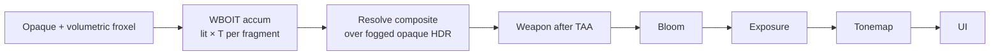

# WBOIT Fog Through Layers

Fog ownership for production WBOIT (`r_oit 1`): opaque background is fogged once; transparent surfaces receive **per-fragment lit fog** during accumulation; resolve must **not** apply a second full-screen fog pass on the transparent result.

**Related:** [MOMENT_OIT_STOCHASTIC_ALPHA.md](MOMENT_OIT_STOCHASTIC_ALPHA.md) · [WBOIT_GPU_CERTIFICATION.md](WBOIT_GPU_CERTIFICATION.md) (B6a fog/volumetrics case) · [OIT_FUTURE_TRACKS.md](OIT_FUTURE_TRACKS.md)

**Demo:** `exec demo_wboit_fog_layers.cfg`

---

## Pass order

World HDR is built in this order (Spine 1.1 / mode 3 clustered path):

```text
opaque (+ volumetrics) → WBOIT fogged-lit accum → resolve over fogged opaque → weapon → bloom → exposure → tonemap → UI
```



Console verification: `oit_fog_status` prints `passOrder=` matching the chain above.

---

## Fog ownership rules

| Stage | Fog applied? | Notes |
|-------|--------------|-------|
| Opaque + volumetrics | **Yes** | Froxel / distance fog on deferred composite **before** OIT |
| WBOIT accumulation | **Yes (mode ≥ 1)** | Lit radiance attenuated once: `lit' = lit × T` |
| WBOIT resolve | **No second fog** | Weighted blend over **already fogged** opaque HDR |
| Post stack (bloom/exposure/tonemap) | **No extra world fog** | Full-screen fog on transparent result is forbidden when `r_oitFogMode>=1` |

**Background already fogged:** resolve reads fogged opaque color underneath; transparent layers only need camera→fragment transmittance on their own lit contribution.

**No second full-screen fog on transparent result:** when `r_oitFogMode>=1`, the post stack must not re-fog the resolved HDR layer. `oit_fog_status` reports `resolveFog=no second full-screen fog on transparent result`.

---

## Transmittance equation

Exponential fog along view-space depth (camera → fragment):

```text
T = exp( -density × viewDepth )
lit' = lit × T
```

- `viewDepth` — distance from `fp_view_org` to fragment world position (see `oit_accum.frag`)
- `density` — `r_oitFogDensity` (0 disables fog even if mode ≥ 1)
- `lit` — Forward+ lit radiance (or unlit base) **before** weighting
- No in-scatter into WBOIT accum (keeps weights stable); fog color comes from opaque path

Shader reference: `renderers/vulkan/shaders/glsl/oit_accum.frag` (`pc.fogMode >= 1 && pc.fogDensity > 1e-6`).

---

## Cvars

### `r_oitFogMode` (0–3, latched, default **1**)

| Value | Name | Behavior |
|-------|------|----------|
| 0 | Legacy | No OIT-specific fog; post stack may fog entire HDR |
| 1 | **Production** | Per-fragment fogged lit radiance in accum |
| 2 | Weighted moments | Optional research path; **currently falls back toward mode 1** until moment fog is validated |
| 3 | Experimental | Enhanced approximation; not Spine 1.1 certified |

### `r_oitFogDensity` (0–1, default 0)

Exponential density for `T=exp(-density×viewDepth)`. Set `>0` with mode ≥ 1 to enable. Demo uses `0.002`.

### `r_oitFogDebug` (0–7, cheat)

| Value | View |
|-------|------|
| 1 | View depth |
| 2 | Transmittance `T` |
| 3 | In-scatter (placeholder) |
| 4 | Weighted depth |
| 5 | Weighted `T` |
| 6 | Double-fog detector (magenta if mode off but density set) |
| 7 | Opaque vs translucent fog difference |

Requires `sv_cheats 1`.

---

## Mode 2 (moments) — future / optional

`r_oitFogMode 2` targets weighted fog moments (analogous to MBOIT transmittance reconstruction) for thick participating media stacks. **Not validated for Spine 1.1.** Until moment fog shaders and resolve coupling are proven on the GPU matrix, the accum path **falls back toward mode 1** behavior (per-fragment `T` on lit radiance).

Track status: [OIT_FUTURE_TRACKS.md](OIT_FUTURE_TRACKS.md).

---

## Volumetric compatibility

- **Preferred:** volumetric fog integrated on **opaque** froxel pass before OIT (`volumetricSource=opaque froxel before OIT` in `oit_fog_status`)
- **B6a cert case:** toggle `r_volumetricFog` + bloom; expect no double-fog bands (`oit_fog_status`, `r_oitFogDebug 6`)
- OIT accum does not sample froxel volume directly in mode 1 — it applies analytic camera→fragment `T` on surface lit terms
- Thick smoke stacks may need mode 2+ or hybrid volume proxies (research)

---

## Material routing flags (documentation only)

Future classify hooks — not separate fog policies in mode 1 today:

| Flag | Typical content | OIT route |
|------|-----------------|-----------|
| `TRANSPARENCY_SURFACE` | Glass, grates, foliage cards | WBOIT accum + mode 1 fog |
| `TRANSPARENCY_PARTICLE` | Additive/modulate particles | Classify bucket; same fog on lit terms |
| `TRANSPARENCY_VOLUME_PROXY` | Camera-aligned smoke quads | WBOIT; density may pair with higher `r_oitFogDensity` |
| `TRANSPARENCY_REFRACTIVE` | Distortion / screenMap / portal | **Excluded** from WBOIT (refractive ping-pong path). Plain `glass`/`water` **names without screenMap stay in WBOIT**. |

See `vk_transparency_route.h` for current `vkTransparencyClass_t` routing.
Macros `TRANSPARENCY_SURFACE` / `PARTICLE` / `VOLUME_PROXY` / `REFRACTIVE` alias the class enum for fog ownership docs.

---

## Acceptance criteria (milestone)

- [x] `r_oitFogMode 1` default with clustered WBOIT overlay (`exec vulkan_overlay_oit_clustered.cfg`)
- [ ] Opaque background visibly fogged before transparent resolve *(operator live)*
- [ ] Glass/smoke layers show single fog falloff — no “double haze” on translucency *(operator live)*
- [x] `oit_fog_status` reports `doubleFogPrevention=enabled (mode>=1)` when active
- [ ] `r_oitFogDebug 2` shows smooth `T` gradient; `6` stays non-magenta when mode ≥ 1 *(operator live)*
- [ ] Resolve + weapon + bloom unchanged except for correct composite (B6a/B6c cert cases pass) *(operator live)*
- [ ] Volumetric fog toggle does not introduce full-screen fog band on transparent result *(operator live)*
- [x] Mode 2 documented as non-shipping fallback; mode 3 experimental only
- [x] Static gates: `test_wboit_fog_*.sh` scripts pass in CI

---

## Quick test procedure

```text
exec demo_wboit_fog_layers.cfg
vid_restart
oit_fog_status
seta r_oitFogDebug 2          // after sv_cheats 1 — view transmittance
// Layer glass in front of fogged world; confirm single attenuation
seta r_oitFogDebug 0
oit_certify_wboit begin       // include B6a bloom/fog/volumetrics case
```
